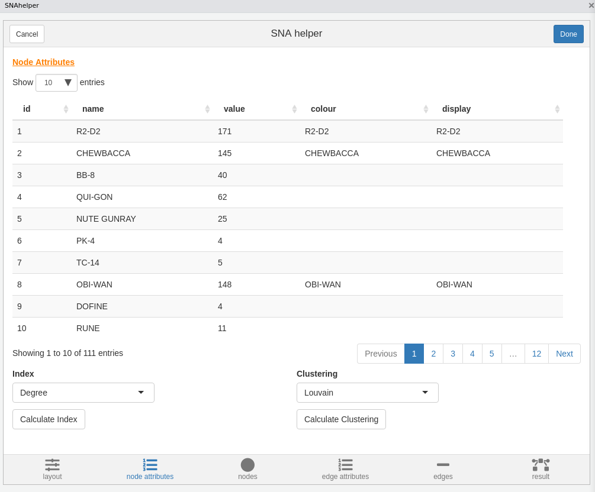
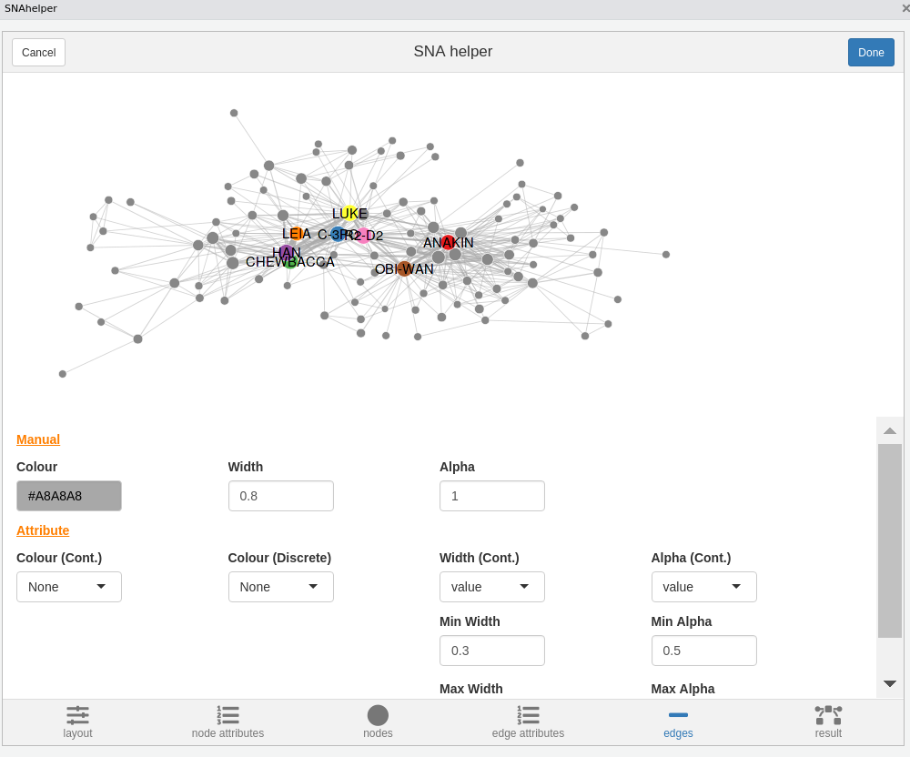
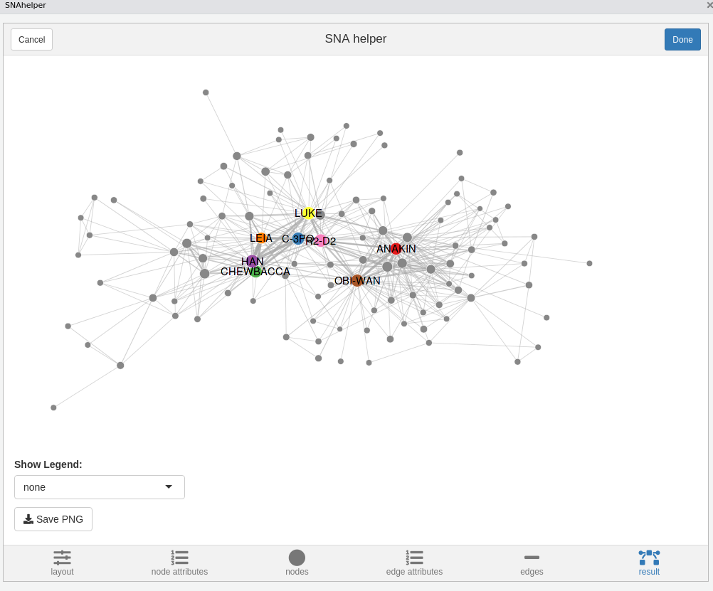

<!-- README.md is generated from README.Rmd. Please edit that file -->

```{r setup, include = FALSE}
knitr::opts_chunk$set(
  collapse = TRUE,
  comment = "#>",
  fig.path = "figures/README-",
  out.width = "100%"
)
```
[](https://www.tidyverse.org/lifecycle/#maturing)
[](https://cran.r-project.org/package=snahelper)
[](https://CRAN.R-project.org/package=snahelper)

# snahelper

`snahelper` is an Rstudio Addin to analyse and visualize networks. 
(*All screenshots are from an older version of the tool*)


## Installation

``` {r install1,eval=FALSE}
# developer version
#install.packages(remotes)
remotes::install_github("schochastics/snahelper")

#CRAN version
install.packages("snahelper")
```


In order to work properly, the Package also needs the `graphlayouts` package, which adds a new
layout algorithm.
```{r install2,eval=FALSE}
install.packages("graphlayouts")
```

## Usage

In order to use the Addin, simply highlight a network in your script and select 
`snahelper` from the Addin dropdown menu.


Below is the code to produce the starwars network used in the gif
```{r starwars,eval=F}
library(tidyverse)
library(igraph)
url <- "https://raw.githubusercontent.com/evelinag/StarWars-social-network/master/networks/starwars-full-interactions-allCharacters.json"
df <- jsonlite::fromJSON(url)

df$nodes$id <- 1:nrow(df$nodes)
df$nodes$display <- df$nodes$name
df$nodes$name <- df$nodes$id-1
g <- graph_from_data_frame(df$links,directed = F,vertices = df$nodes)

V(g)$name <- V(g)$display

g <- remove.vertex.attribute(g,"id")
g <- remove.vertex.attribute(g,"display")
g <- delete.vertices(g,which(degree(g)==0))

V(g)$display <- ifelse(V(g)$value>75,V(g)$name,"")
V(g)$colour <- ifelse(V(g)$display=="",NA,V(g)$display)

g

```


## Interface

### Layout

The layout tab allows you to choose from all implemented algorithms in `igraph` and
the stress based layout from `smglr`, which is the default and recommended choice.
See [my blog](http://blog.schochastics.net/post/stress-based-graph-layouts/) for an
explanation. In the tweak section you can move individual nodes around. The implementation
is still very crude, so don't expect miracles from that. The layout is saved as node attributes
x and y.


### Node Attribute Manager

The Node Attribute Manager shows all existing node attributes in a sortable table.
In addition, you can calculate some new ones (centrality and clustering). 
More will be added in the future.



### Nodes

This is where you can style your nodes. You can either do it manually, by choosing a
color/size for all nodes together, or based on an attribute.


### Edge Attribute Manager

Same as Node Attribute Manager but for edges. So far only shows existing edge attributes.


### Edges

You can style your edges here. `snahelper` automatically detects if your network
is directed and adds arrows if the network is directed. The other options are similar to the nodes tab.
~~The curvature option allows you to bend edges. I highly suggest, that you only bend your
edges if there are two edges running between the same set of nodes to make them visible.
If you do not have reciprocal edges, then just leave it at 0.~~ 
Edges are now drawn with `geom_edge_fan` to automatically bend reciprocal edges and leave other
edges straight. The `Pts. per Edge` input controls the number of points drawn along the edge.
In most use cases this should simply be 2. The value should be increased though in the presence of reciprocal directed edges.



### Result

The result tab shows the network in its full size. If you are satisfied with the results, hit
the Done button and the R code to produce the plot is automatically inserted in your script.


