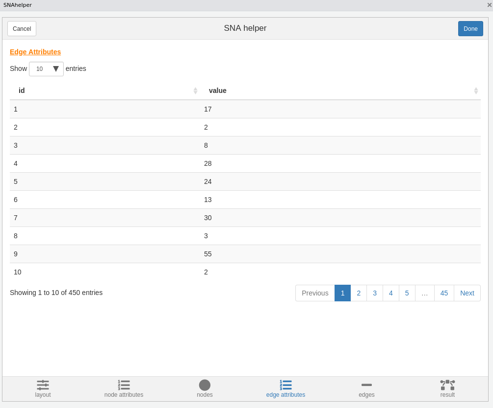

<!-- README.md is generated from README.Rmd. Please edit that file -->

# snahelper

`snahelper` is an Rstudio Addin to analyse and visualize networks.


## Installation

You can install the developer version with:

``` r
#install.packages(devtools)
devtools::install_github("schochastics/snahelper")
```

In order to work properly, the Package also needs the `smglr` Package,
which adds a new layout algorithm.

``` r
devtools::install_github("schochastics/smglr")
```

## Usage

In order to use the Addin, simply highlight a network in your script and
select `snahelper` from the Addin dropdown menu.


## Interface

### Layout

The layout tab allows you to choose from all implemented algorithms in
`igraph` and the stress based layout from `smglr`, which is the default
and recommended choice. See [my
blog](http://blog.schochastics.net/post/stress-based-graph-layouts/) for
an explanation. In the tweak section you can move individual nodes
around. The implementation is still very crude, so don’t expect miracles
from that. The layout is saved as node attributes x and y.


### Node Attribute Manager

The Node Attribute Manager shows all existing node attributes in a
sortable table. In addition, you can calculate some new ones (centrality
and clustering). More will be added in the future.


### Nodes

This is where you can style your nodes. You can either do it manually,
by choosing a color/size for all nodes together, or based on an
attribute.


### Edge Attribute Manager

Same as Node Attribute Manager but for edges. So far only shows existing
edge attributes.



### Edges

You can style your edges here. `snahelper` automatically detects if your
network is directed and adds arrows if the network is directed. The
other options are similar to the nodes tab. ~~The curvature option
allows you to bend edges. I highly suggest, that you only bend your
edges if there are two edges running between the same set of nodes to
make them visible. If you do not have reciprocal edges, then just leave
it at 0.~~ Edges are now drawn with `geom_edge_fan` to automatically
bend reciprocal edges and leave other edges straight.


### Result

The result tab shows the network in its full size. If you are satisfied
with the results, hit the Done button and the R code to produce the plot
is automatically inserted in your script.


