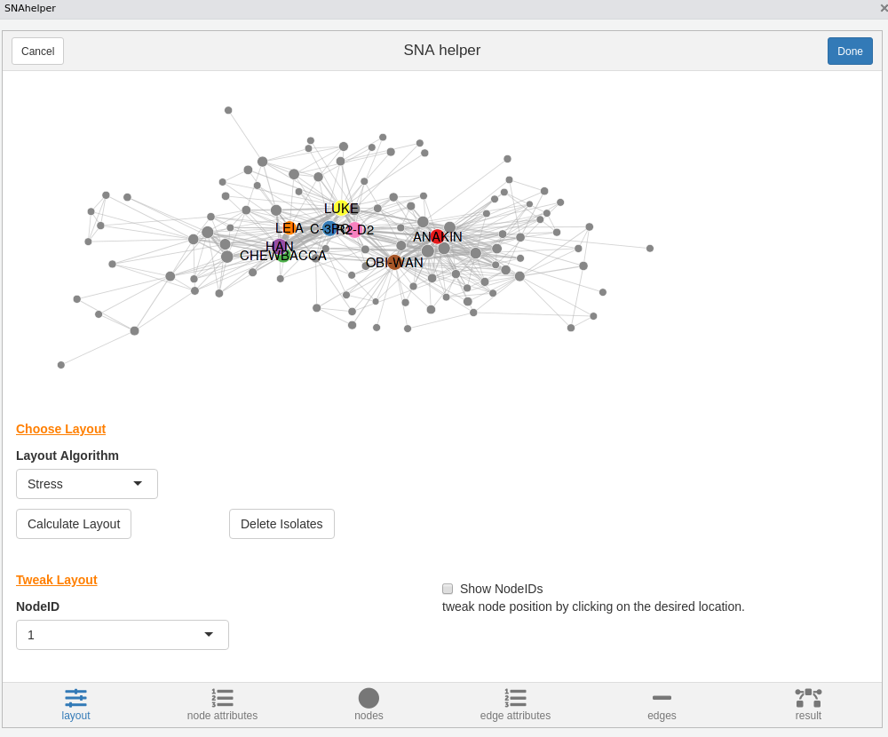
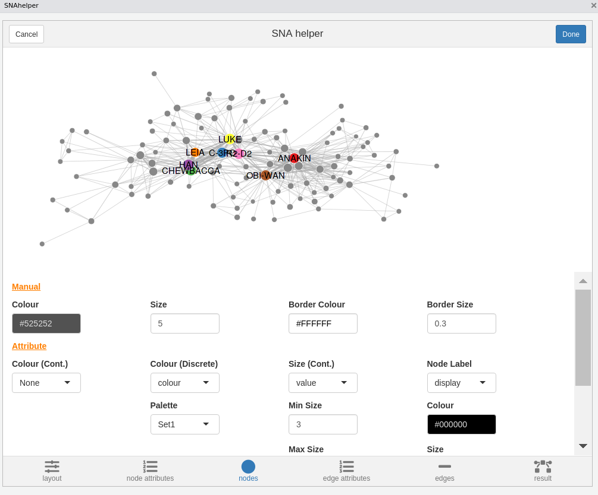

<!-- README.md is generated from README.Rmd. Please edit that file -->

# snahelper 

[](https://www.tidyverse.org/lifecycle/#stable)
[](https://cran.r-project.org/package=snahelper)
[](https://CRAN.R-project.org/package=snahelper)

`snahelper` provides a set RStudio Addin for social network analysis.
The main addin is the `SNAhelper` which provides a simple GUI to do
common network analytic tasks and visualize a network with
[ggraph](https://ggraph.data-imaginist.com/).

The second addin, called `Netbuilder` allows you to quickly build small
networks with a small “canvas” to draw on. The network can be exported
as an igraph object at the end of the session by clicking on “Done”.

The third addin `Netreader` is meant to facilitated the import of raw
network data. It provides a GUI to easily read network and attribute
data and combine them to an igraph object. The underlying code of the
import procedure is shown at the end. This should help users to learn
importing data themselves.

The fourth addin `Componentlayouter` allows to layout networks with
several components manually by placing them on an empty canvas.
Components can also be rotated and resized. After finishing the session,
the layout is saved as x and y vertex attributes.

## Quick look at the SNAhelper


Code to reproduce the used network.

``` r
library(tidyverse)
library(igraph)
url <- "https://raw.githubusercontent.com/evelinag/StarWars-social-network/master/networks/starwars-full-interactions-allCharacters.json"
df <- jsonlite::fromJSON(url)

df$nodes$id <- 1:nrow(df$nodes)
df$nodes$display <- df$nodes$name
df$nodes$name <- df$nodes$id-1
g <- graph_from_data_frame(df$links,directed = F,vertices = df$nodes)

V(g)$name <- V(g)$display

g <- remove.vertex.attribute(g,"id")
g <- remove.vertex.attribute(g,"display")
g <- delete.vertices(g,which(degree(g)==0))

V(g)$display <- ifelse(V(g)$value>75,V(g)$name,"")
V(g)$colour <- ifelse(V(g)$display=="",NA,V(g)$display)

g
```

## Quick look at the Netreader

`Netreader` should be pretty selfexplanatory. The first two tabs allow
you to import raw data (edges and attributes). Make sure to specify file
delimiters, etc. according to the shown preview.


Using the `Netreader` should comes with a learning effect (hopefully).
The last tab shows the R code to produce the network with the chosen
data **without** using the Addin. 

The network will be saved in your global environment once you click
“Done”.

## Quick look at the Netbuilder


## Quick look at the Componentlayouter


Highlight an igraph object in your script and selcet the
`Componentlayouter` from the RStudio addin menu. Components are added by
clicking on the canvas and can be resized/rotated and re-positioned
using the buttons at the bottom.

## Installation

``` r
# developer version
#install.packages(remotes)
remotes::install_github("schochastics/snahelper")

#CRAN version
install.packages("snahelper")
```

To work properly, you also need
[graphlayouts](https://github.com/schochastics/graphlayouts), which adds
new layout algorithms.

``` r
install.packages("graphlayouts")
```

## Usage of SNAhelper

To use the main addin, simply highlight a network in your script and
select `SNAhelper` from the Addin dropdown menu.

## Interface

### Layout

The layout tab allows you to choose from all implemented algorithms in
`igraph` and some layouts from `graphlayouts`. The default is a stress
based layout and also the recommended choice. See [my
blog](http://blog.schochastics.net/post/stress-based-graph-layouts/) for
an explanation. In the tweak section you can move individual nodes
around. Choose the node from the dropdown menu and click on its new
position in the plot.



### Node Attribute Manager

The Node Attribute Manager shows all existing node attributes in a
sortable table. In addition, you can calculate some new ones (centrality
and clustering). The functions automatically choose the right version of
indices, depending if the network is
directed/weighted/undirected/unweighted.


### Nodes

This is where you can style your nodes. You can either do it manually,
by choosing a color/size for all nodes together, or based on an
attribute.



### Edge Attribute Manager

Same as Node Attribute Manager but for edges. So far only shows existing
edge attributes.


### Edges

You can style your edges here. `snahelper` automatically detects if your
network is directed and adds arrows if the network is directed. The
other options are similar to the nodes tab. The snahelper automatically
chooses the appropriate edge geom. If multiple edges are present, it
uses `geom_edge_parallel0()`. Otherwise `geom_edge_link0()`.


### Result

The result tab shows the network in its full size. If you are satisfied
with the results, hit the Done button and the R code to produce the plot
is automatically inserted in your script. Or you can directly save the
result as a png file.


